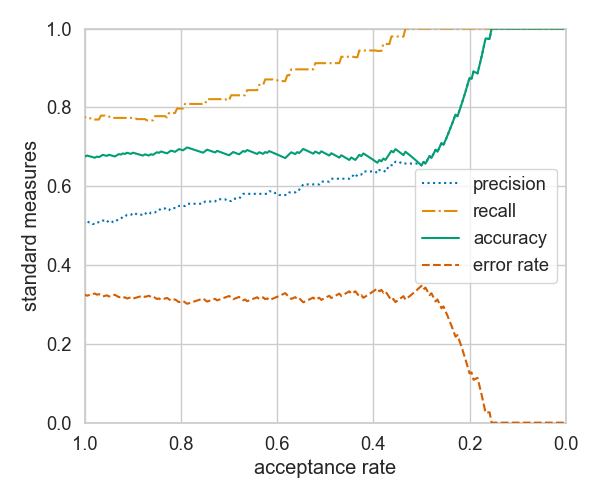
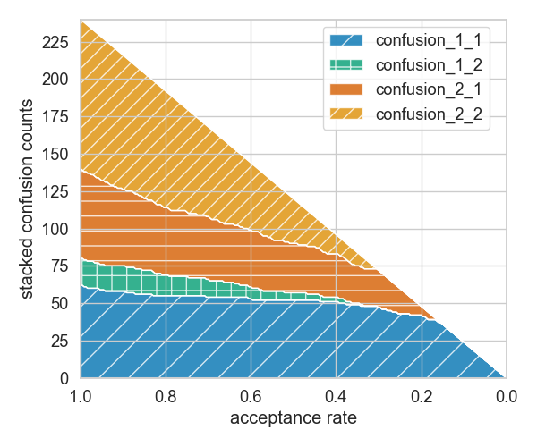
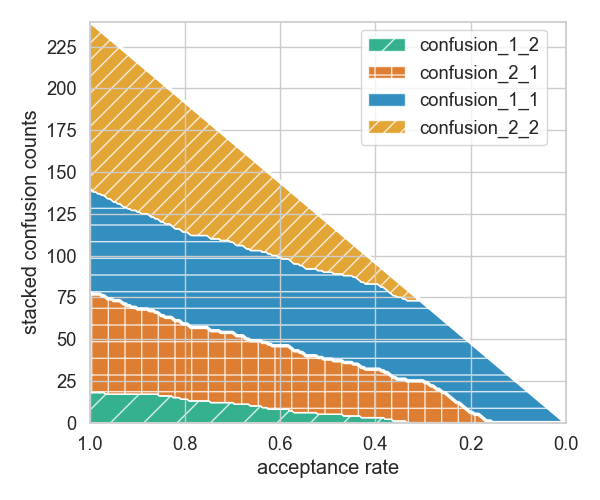
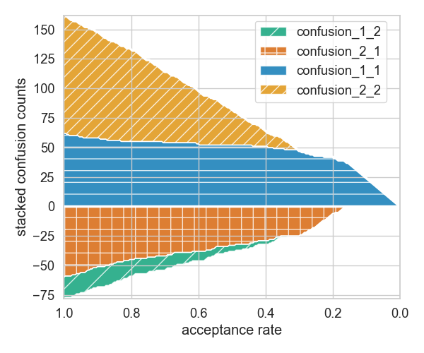
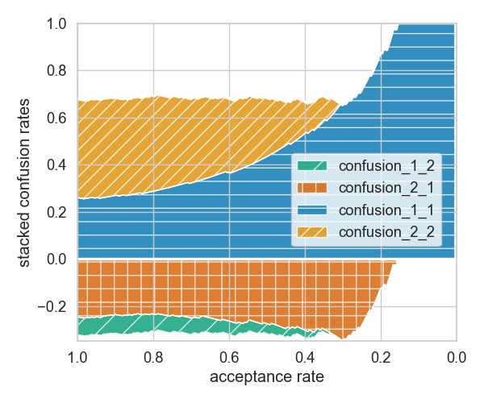
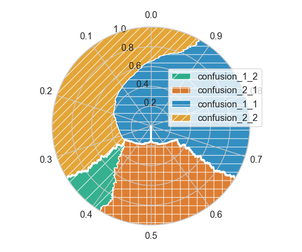
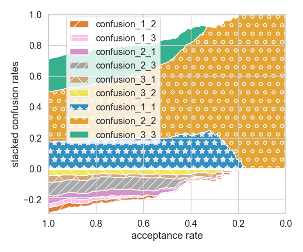
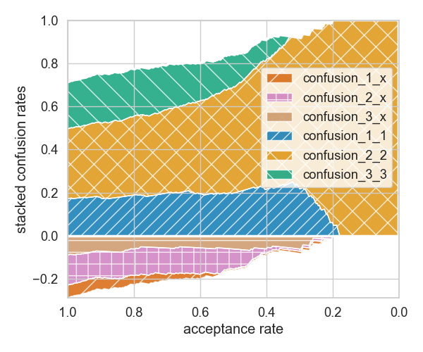

# score

This project offers to do Stacked Confusion Reject (SCORE) plots to visualize classification with reject option.
This gives more insight than using standard accuracy-reject-curves.




```bash
# The commands used to generate these plots were (except placement of the legend):
./scripts/plot_csv.py data/bayes_2_classes.csv -t reject 
./scripts/plot_csv.py data/bayes_2_classes.csv -t stack 
```


# Getting started
You can use the package from source by executing:
```bash
# Setup a virtual python environment (once).
./create_venv.sh 

# Source the virtual python environment and set the PYTHONPATH. 
source local.env

# Plot some very simple predefined 2-class data. This shows the basic usage of the package.
./examples/example.py

# Plot data from a CSV-file. 
./scripts/plot_csv.py data/bayes_2_classes.csv

# Get all plotting options.
./scripts/plot_csv.py -h
```


# Assumptions
We assume that the input data (CSV-file, or internally a pandas.Dataframe) has the following columns:
- **ground_truth**: The ground truth categorical label of a sample.
- **prediction**: The predicted categorical label of a sample.
- **certainty**: The continuous certainty of the prediction.

For the CSV-file the column names should be given in the first line of the file.


# Evaluation and plotting options
The internal **plot** function has several options to highlight certain aspects of the confusion stack
or change the plot type:
- **type**: Define the plotting type. **Type.[STACK, PIE, REJECT]**
- **order**: Define the order of confusions in the stack **Order.[AS_IS, CORRECT_LAST]**
- **alignment**: Define where the zero line should be in the stack. **Alignment.[BOTTOM, CORRECT_START, CORRECT_CENTER]**
- **normalize**: Whether to normalize the confusions with the total number of samples. **[True, False]**







```bash
# The commands used to generate these plots were (except placement of the legend):
./scripts/plot_csv.py data/bayes_2_classes.csv -t stack -o correct_last
./scripts/plot_csv.py data/bayes_2_classes.csv -t stack -o correct_last -a correct_start 
./scripts/plot_csv.py data/bayes_2_classes.csv -t stack -o correct_last -a correct_start -n 
./scripts/plot_csv.py data/bayes_2_classes.csv -t pie -o correct_last -a correct_center
```

The internal **evaluate_confusion** function has the option:
- **condense_errors**: Whether to treat all wrong predictions of a ground truth class as a single confusion case.
  This is helpful for settings with more than 2 classes. **[True, False]**




```bash
# The commands used to generate these plots were (except placement of the legend):    
./scripts/plot_csv.py data/bayes_3_classes.csv -t stack -o correct_last -a correct_start -n 
./scripts/plot_csv.py data/bayes_3_classes.csv -t stack -o correct_last -a correct_start -n -c
```


# Additional Scripts
```bash
# Generate some pre-defined Gaussian data including confidence and class estimated by an optimal Bayes to a csv file.
./scripts/bayes_data.py data_file.csv

# Generate the example plots used in the paper and in the documentation 
# with more control over figure and legend parameters.
./scripts/save_example_plots.py
```

# BibTeX Citation
If you use SCORE in a scientific publication, we would appreciate using the following citation:
```
@misc{Hasler2024,
    title         = {{Stacked Confusion Reject Plots (SCORE)}}, 
    author        = {Stephan Hasler and Lydia Fischer},
    year          = {2024},
    eprint        = {2406.17346},
    archivePrefix = {arXiv},
    primaryClass  = {cs.LG}
    url           = {https://arxiv.org/abs/2406.17346}, 
}
```

# References:
- Stacked Confusion Reject Plots:
  - S. Hasler and L. Fischer. Stacked Confusion Reject Plots (SCORE), arXiv, 2024.
- Precision-reject-curves and recall-reject-curves:
  - L. Fischer and P. Wollstadt. Precision and Recall Reject Curves. Accepted for WSOM, 2024.
- Accuracy-reject-curves:
  - M. S. A. Nadeem, J. D. Zucker, and B. Hanczar. Accuracy-rejection curves (ARCs) for
    comparing classification methods with a reject option. In Machine Learning in Systems Biology, pages 65-81, PMLR, 2009.
